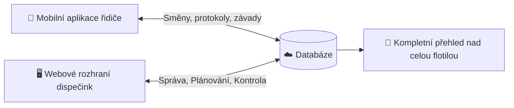

# Vítejte v systému Bručounkova garáž

**Bručounkova garáž** je ucelený ekosystém pro inteligentní správu vozového parku, dispečinku a řidičů pro **Taxi Bručounek**. 

Propojuje webový dispečinkový portál v reálném čase s mobilní aplikací řidičů v terénu a centralizovanou databází.

---

## 🎯 Hlavní součásti ekosystému

### 1. 📱 Mobilní aplikace pro řidiče
- Rychlé přihlášení pomocí PINu / přihlašovacích údajů.
- Zahájení a ukončení směny s okamžitou kontrolou vozu.
- **Digitální předávací protokol**: fotodokumentace stavu vozidla, záznam stavu tachometru a paliva.
- Okamžité hlášení technických závad nebo poškození přímo do dispečinku.

### 2. 🖥️ Webové rozhraní dispečink
- Přehledná mapa a realtime stav flotily vozidel.
- Schvalování a kontrola předávacích protokolů.
- Tvorba a plánování směn řidičů.
- Evidence vozidel, servisních prohlídek, pojištění a STK.

### 3. 📄 Generování a archivace protokolů
- Každé předání vozidla automaticky vygeneruje podrobný PDF protokol včetně fotografií, podpisů a časových razítek, který je bezpečně archivován.

---

## 🚀 Kde začít?

- **Jste řidič?** Podívejte se na [Příručku pro mobilní aplikaci](/docs/ridici/mobilni-aplikace).
- **Jste dispečer nebo vedoucí provozu?** Přejděte na [Manuál dispečinku](/docs/dispecink/uvod).
- **Řešíte předání vozu nebo škodu?** Prostudujte [Předávací protokoly](/docs/vozidla/predavaci-protokoly) a [Hlášení závad](/docs/vozidla/hlaseni-zavad).

:::tip Potřebujete okamžitou pomoc na směně?
V případě neodkladných provozních dotazů nebo nehod kontaktujte dispečink na telefonním čísle **+420 123 456 789**.
:::
